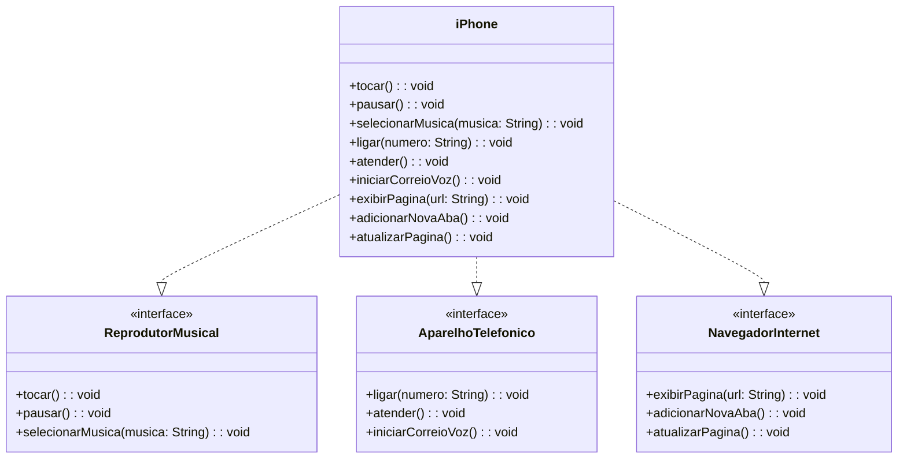

### Exemplo de Diagrama UML (Mermaid)

```mermaid
classDiagram
class ReprodutorMusical {
  <<interface>>
  +tocar(): void
  +pausar(): void
  +selecionarMusica(musica: String): void
}

class AparelhoTelefonico {
  <<interface>>
  +ligar(numero: String): void
  +atender(): void
  +iniciarCorreioVoz(): void
}

class NavegadorInternet {
  <<interface>>
  +exibirPagina(url: String): void
  +adicionarNovaAba(): void
  +atualizarPagina(): void
}

class iPhone {
  +tocar(): void
  +pausar(): void
  +selecionarMusica(musica: String): void
  +ligar(numero: String): void
  +atender(): void
  +iniciarCorreioVoz(): void
  +exibirPagina(url: String): void
  +adicionarNovaAba(): void
  +atualizarPagina(): void
}

iPhone ..|> ReprodutorMusical
iPhone ..|> AparelhoTelefonico
iPhone ..|> NavegadorInternet
```